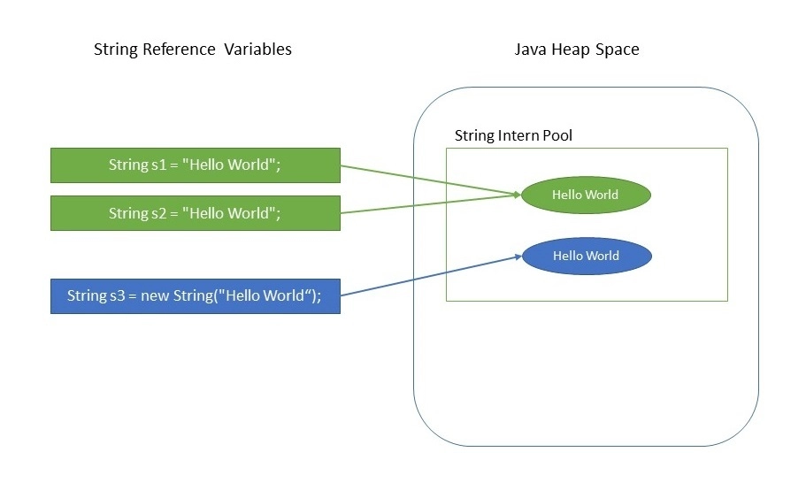
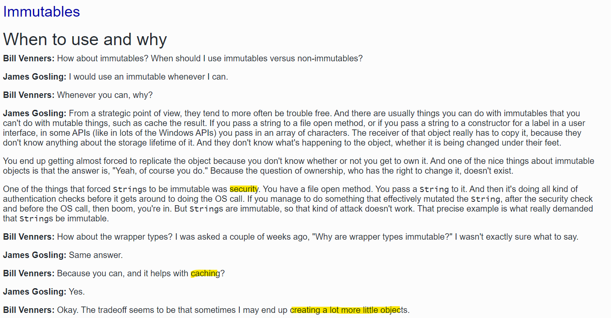
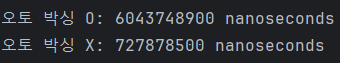

## 불필요한 객체 생성을 피하라

### 1. 객체를 재사용하자
자바에서 `String` 인스턴스 생성 방식의 차이에 대해 알아보겠습니다.

```java
// new 연산자 사용
String s1 = new String("이펙티브 듀오!");

// 리터럴을 사용
String s2 = "이펙티브 듀오!";
```
위 두 예제 코드의 차이가 무엇일까요?
`new` 연산자를 통해 문자열 객체를 생성할 경우, 메모리의 **Heap 영역**에 할당됩니다.  
반면, 두번째 방법은 리터럴 방식으로 생성하며, **String Constant Pool** 영역에 할당됩니다.  

<div align='center'>
    
</div>  


> **Interning** :  
String을 literal로 초기화 할 경우 내부적으로 `String.intern()` 메서드가 호출됩니다.  
JVM은 String Constant Pool에 각 문자열 값의 복사본을 하나 저장하고 String 변수가 만들어지면 String Constant Pool에서 동일한 값이 있는지 찾아봅니다.  
만약 있으면 그 주소값을 반환하여 재사용합니다.  

<br></br>

```java
System.out.println("s1 == s2 : " + (s1 == s2)); //false
```
문자열이 담기는 상수풀의 위치는 **자바 7**부터 **Heap 영역**으로 옮겨졌습니다.  
따라서, Heap 영역에서 할당하는 메모리 번지가 다르기 때문에 false가 나옵니다.

<details>
<summary>String Constant Pool</summary>  

상수풀(String Constant Pool)의 위치는 Java 7부터 **Perm영역**에서 **Heap영역**으로 옮겨졌습니다.  
Perm(Permanent Generation) 영역은 런타임에 크기를 가변적으로 조정할 수 없는 고정된 영역이기 때문에, intern 메서드의 호출로 인해 공간이 부족해질 수 있습니다.  
이는 OOM(Out Of Memory) 문제를 일으킬 수 있는 위험이 있었습니다.  
그러나 Heap 영역으로 변경된 이후에는 상수 풀에 저장된 문자열도 Garbage Collection의 대상이 되므로, 이러한 문제가 해결되었습니다.
Java 8 버전에서는 Perm 영역은 완전히 사라지고 이를 **MetaSpace 영역**이 대신하고 있다.  

</details>  

<br></br>

### 스트링은 왜 불변인가요?
<div align='center'>
    
</div>   

자바를 직접 제작한 <i>제임스 고슬링</i>에 의하면 **보안**, **캐싱**, **불필요한 객체 생성 방지** 때문이라고 합니다.    
만약, Database 연결에 필요한 URL이 변경되거나 한다..?  무결성 검사 후에 변경되어 SQL 주입에 취약할 수 있습니다.  

<br></br>

### 2. 정적 팩터리 메서드를 사용하자  
팩터리 메서드는 생성자와 달리 호출할 때마다 새로운 객체를 만들지 않기에, 재사용이 가능합니다.  

```java
public final class Boolean implements java.io.Serializable, Comparable<Boolean> {

    public static final Boolean TRUE = new Boolean(true);
    public static final Boolean FALSE = new Boolean(false);
    
    ... //생략

    public static boolean parseBoolean(String s) {
        return "true".equalsIgnoreCase(s);
    }

    ... //생략

    public static Boolean valueOf(String s) {
        return parseBoolean(s) ? TRUE : FALSE;
    }
}
```  
`Boolean.valueOf(String)`정적 팩터리 메서드를 사용하여 미리 생성된 TRUE, FALSE를 반환하는 것을 확인할 수 있습니다.  

<br></br>

### 3. 캐싱을 사용하자  
생성 비용이 비싼 객체도 있습니다.  
여기서 <i>비싸다</i>란 메모리, 디스크 사용량, 대역폭 등이 높다는 의미입니다.  

```java
static boolean isRomanNumeral(String str) {
    return str.matches("^(?=.)M*(C[MD]|D?C{0,3})(X[CL]|L?X{0,3})(I[XV]|V?I{0,3})$");
}
```  
`Pattern 인스턴스`는 입력받은 정규표현식의 유한 상태 머신을 만들기 때문에 생성 비용이 높습니다.  
이런 생성 비용이 높은 Pattern 인스턴스를 한 번 쓰고 버리는 구조로 만들어 곧바로 GC의 대상이 되게 만들고 있습니다.  
즉, 비싼 객체라고 할 수 있습니다.  

> **유한 상태 머신** :  
한 번에 하나의 상태만 가질 수 있는 시스템을 의미합니다.  
이 시스템은 일련의 입력에 따라 상태가 변하며, 미리 정의된 유한한 상태 집합 내에서 이동합니다.


```java
public class RomanNumber {
    private static final Pattern ROMAN = Pattern.compile("^(?=.)M*(C[MD]|D?C{0,3})(X[CL]|L?X{0,3})(I[XV]|V?I{0,3})$");

    static boolean isRomanNumeral(String str) {
        return ROMAN.matcher(str).matches();
	}
}
```  
이에, `Pattern 인스턴스`를 캐싱하여 `isRomanNumeral`이 호출될 때마다 재사용합니다.  

<br></br>

### 4. 오토 박싱을 사용할 때 주의!
오토 박싱은 기본 타입과 박싱된 기본 타입을 자동 변환해주는 기술입니다.  

```java
public class Test {

    public static void autoBoxing_Test() {
        Long sum = 0L;
        for(long i = 0; i <= Integer.MAX_VALUE; i++) {
            sum += i;
        }
    }

    public static void noneBoxing_Test() {
        long sum = 0L;
        for(long i = 0; i < Integer.MAX_VALUE; i++) {
            sum += i;
        }
    }

    public static void main(String[] args) {
        long startTime = System.nanoTime();
        autoBoxing_Test();
        long endTime = System.nanoTime();
        long durationAutoBoxing = endTime - startTime;
        System.out.println("오토 박싱 O: " + durationAutoBoxing + " nanoseconds");

        startTime = System.nanoTime();
        noneBoxing_Test();
        endTime = System.nanoTime();
        long durationNoneBoxing = endTime - startTime;
        System.out.println("오토 박싱 X: " + durationNoneBoxing + " nanoseconds");
    }
}
```
<div align='center'>
    
</div>    

차이가 많이납니다..!!  
기본 타입을 사용하도록 하고, 의도치 않은 오토박싱이 숨어들지 않도록 주의합시다.

---

### 📌 Reference

- 이펙티브 자바
- [[Java] String 생성 방식! 리터럴방식(상수풀) vs new 연산자 방식](https://velog.io/@mooh2jj/%EC%9E%90%EB%B0%94%EC%9D%98-String-%EC%83%9D%EC%84%B1-%EB%B0%A9%EC%8B%9D-%EB%A6%AC%ED%84%B0%EB%9F%B4%EB%B0%A9%EC%8B%9D-vs-new-%EC%97%B0%EC%82%B0%EC%9E%90-%EB%B0%A9%EC%8B%9D)
- [String은 왜, 어떻게 불변 객체인가요? String Constant Pool](https://velog.io/@ur2e/String%EC%9D%80-%EC%99%9C-%EA%B7%B8%EB%A6%AC%EA%B3%A0-%EC%96%B4%EB%96%BB%EA%B2%8C-%EB%B6%88%EB%B3%80-%EA%B0%9D%EC%B2%B4%EC%9D%B8%EA%B0%80%EC%9A%94-String-Constant-Pool)