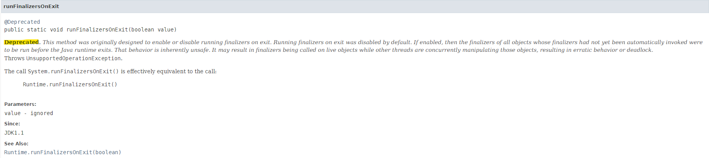
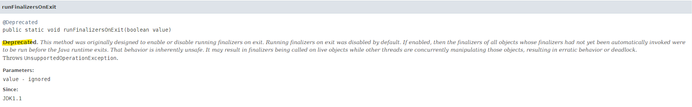
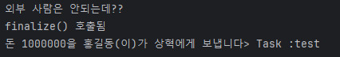

## finalizer와 cleaner 사용을 피하라  
### 자바의 두 가지 객체 소멸자
### finalizer
**Finalizer**는 자바에서 객체가 가비지 컬렉션될 때 호출되는 메서드입니다.  

객체가 더 이상 참조되지 않고 가비지 컬렉터에 의해 수거될 때, finalize() 메서드가 호출됩니다.  

이는 주로 자원 정리, 예를 들어 파일 닫기, 네트워크 연결 종료 등과 같은 작업을 수행하는 데 사용되었습니다.  

### cleaner
**Cleaner**은 Java 9에서 도입된 새로운 자원 정리 메커니즘입니다.  

finalize() 메서드의 단점을 보완하기 위해 만들어졌습니다.   

### finalizer와 cleaner의 단점들
### 1) 🐌 ..느리다
finalizer와 cleaner는 즉시 수행된다는 보장이 없다. 언제 실행될 지 알 수 없으며 시간이 얼마나 걸릴지는 아무도 모릅니다.  

**즉, 제때 실행하게 하는 작업은 절대 할 수 없습니다.**  
- 파일 리소스를 반납하는 작업을 처리한다면 그 파일 리소스가 언제 처리 될지 알 수 없습니다.
- 반납이 되지 않아 새로운 파일을 열지 못 하는 상황이 발생할 수 있습니다.
- 동시에 열 수 있는 파일 개수가 제한되어 있습니다.

### 2) 🤦‍♂️ 얼마나 신속히 수행할지는 모른다
온전히 GC의 알고리즘에 의존하기에 고객 시스템에서 재앙을 불러일으킬 수 있습니다.  

### 3) ⬇️ 우선순위가 낮다
finalizer의 스레드는 다른 애플리케이션 스레드보다 우선순위가 낮아서 언제 실행될 수 있는지를 모릅니다.  

finalizer가 회수해야하는 여러 객체들이 있더라도 GC가 회수하지 못하고 대기하다가 **OutOfMemoryError**를 발생시킬 수 있습니다.  

### 4) ❌ 수행 시점 및 수행 여부를 보장하지 않는다  
데이터베이스 같은 공유 자원의 영구 락(lock) 해제를 finalizer 혹은 cleaner에게 맡겨두면 점차 멈출것입니다.

### System.gc() 혹은 System.runFinalization에 현혹되지 말자  
finalizer와 cleaner의 실행 가능성을 높여주고자 등장했으나 지탄만 받고 사라졌습니다..
<div>
    
</div>
<div>
    
</div>

### 5) 🤷‍♂️ 경고조차 없다
finalizer의 동작 과정 중 발생한 예외에 대해 설령 처리할 작업이 남아있더라도 종료되며 잡지 못한 에러는 그대로 남을 수 있습니다.  

다른 스레드가 훼손된 객체를 사용하려 한다면 예측 불가능하고 finalizer는 경곷조차 출력하지 않습니다.  

다행이도(?) cleaner의 경우 자신의 스레드를 통제하기에 이러한 문제는 발생하지 않습니다.

### 6) 🖥️ 성능에도 문제가 있다  
AutoCloseable 객체를 생성하고 try-with-resources로 자원을 닫아서 가비지컬렉터가 수거하기까지 12ns가 걸렸다면 finalizer를 사용한 객체를 생성하고 파괴하니 550ns가 걸렸습니다. (50배)

finalizer가 가비지 컬렉터의 효율을 떨어지게 한다. 하지만 잠시 후 알아볼 안전망 형태로만 사용하면 66ns가 걸린다.  

안전망의 대가로 50배에서 5배로 성능차이를 낼 수 있습니다.

### finalizer attack에 의한 보안 문제가 발생 가능하다  
이펙티브 듀오끼리만 돈을 전달가능하게끔 코드를 구현하고자 했습니다.  

하지만 finalizer를 `BrokenDuo`가 구현하며 GC가 메모리를 회수하는 과정에서 `finalizer`를 호출하며 외부 사람인 **홍길동**씨가 돈을 보낼 수 있게 되었습니다.
```java
public class EffectiveDuo {
    private String name;

    public EffectiveDuo(String name) {
        this.name = name;

        if (!this.name.equals("상혁") && !this.name.equals("영현")) {
            throw new IllegalStateException("이펙티브 듀오끼리만 가능해~~");
        }
    }

    public void transfer(BigInteger money, String to) {
        System.out.printf("돈 %d을 %s(이)가 %s에게 보냅니다", money, this.name, to);
    }
}

public class BrokenDuo extends EffectiveDuo {
    public BrokenDuo(String name) {
        super(name);
    }

    @Override
    protected void finalize() throws Throwable {
        System.out.println("finalize() 호출됨");
        this.transfer(BigInteger.valueOf(1000000), "상혁");
        System.out.flush();
    }
}
```

```java
class EffectiveDuoTest {
    @Test
    void 외부_사람_이펙티브_듀오() throws InterruptedException {
        EffectiveDuo duo = null;
        try {
            duo = new BrokenDuo("홍길동");
        } catch (Exception exception) {
            System.out.println("외부 사람은 안되는데??");
        }

        System.gc();
        Thread.sleep(3000L);
    }
}
```

<div>
    
</div>

이를 방어하기 위해 다음과 같이 `EffectiveDuo` 코드를 수정가능합니다.

```java
public class EffectiveDuo {
    private String name;

    public EffectiveDuo(String name) {
        this.name = name;

        if (!this.name.equals("상혁") && !this.name.equals("영현")) {
            throw new IllegalStateException("이펙티브 듀오끼리만 가능해~~");
        }
    }

    public void transfer(BigInteger money, String to) {
        System.out.printf("돈 %d을 %s(이)가 %s에게 보냅니다", money, this.name, to);
    }

    @Override
    protected final void finalize() throws Throwable {
    }
}
```

이렇게 되면 `BrokenDuo`에서는 상속을 하지 못하기에 **finalizer attack**을 방어가능합니다.


```
🐱영현 : 그럼 도대체 대안이 뭐야?
🌱상혁 : AutoCliseable이 있어
```  

### AutoCloseble을 구현하라  
`finalizer`와 `cleaner`를 대신하기 위해 **AutoCloseable**을 구현하고, 인스턴스를 다 사용하고 난 뒤 `close` 메서드를 호출하면 됩니다.  

예외가 발생하더라도 제대로 종료가능하도록 **try-with-resources** 구문을 사용해야 합니다.  

```java
public class Example implements AutoCloseable {

    @Override
    public void close() {
        System.out.println("close");
    }

}
```  

### finalizer와 cleaner의 사용처
```
🐱영현 : 저렇게나 단점이 많은데, 사용할 수 있는곳이 있어?
🌱상혁 : 개똥도 쓸데는 있더라 ㅎ..
```  

### 1) 🥅 안전망 역할
자원의 소유자가 close 메서드를 깜빡하고 호출하지 않은 경우 대비용으로 사용가능합니다.  

물론 호출되리라는 보장은 없지만 아예 안 하는것보다는 낫기 때문입니다.  

자바의 `FileInputStream`, `FileOutputStream`, `ThreadPoolExecutor`가 대표적입니다.  

### 2) 🫱 네이티브 객체 회수    
> 네이티브 피어 : 일반 자바 객체가 네이티브 메서드를 통해 기능을 위임한 네이티브 객체  

네이티브 피어는 자바 객체가 아니니 GC는 그 존재조차 알지 못하기에 자바 피어를 회수할 때 네이티브 객체까지 회수하지 못 합니다.  

성능 저하를 감당할 수 없거나 자원을 즉시 회수해야 한다면 close 메서드를 사용해야 합니다.  

### Cleaner 사용하기  

```java
public class Room implements AutoCloseable {
    private static final Cleaner cleaner = Cleaner.create();

    // 청소가 필요한 자원. 절대 Room을 참조해서는 안 된다!
    private static class State implements Runnable { 
        int numJunkPiles;

        State(int numJunkPiles) {
            this.numJunkPiles = numJunkPiles;
        }

        // close 메서드나 cleaner가 호출한다.
        @Override
        public void run() { 
            System.out.println("Room Clean");
            numJunkPiles = 0;
        }
    }

    // 방의 상태, cleanable과 공유한다.
    private final State state;

    // cleanable 객체. 수거 대상이 되면 방을 청소한다.
    private final Cleaner.Cleanable cleanable;

    public Room(int numJunkPiles) {
        state = new State(numJunkPiles);
        cleanable = cleaner.register(this, state);
    }

    @Override
    public void close() {
        cleanable.clean();
    }
}
```  
State 인스턴스가 Room 인스턴스를 참조할 경우 순환참조가 발생하고 가비지 컬렉터가 Room을 회수해갈 기회가 오지 않습니다.  

State가 static인 이유도 바깥 객체를 참조하지 않기 위해서이다.  

만약 Room 인스턴스를 참조할 경우 순환참조가 생겨  GC가 Room 인스턴스를 회수할 기회가 오지 않습니다. => **State가 정적 중첩 클래스인 이유!**

### 잘 짠 코드  

```java
public static void main(final String[] args) {
    try (Room myRoom = new Room(7)) {
        System.out.println("안녕~");
    }
}
```

```java
public static void main(final String[] args) {
    new Room(8);
    System.out.println("아무렴");
}
```  

말 그대로 Room의 클리너는 안전망으로만 사용되었기에 모든 Room 생성 자체를 `try-with-resources` 블록으로 감쌌다면 자동 청소는 전혀 필요하지 않습니다.


---

### 📌 Reference

- 이펙티브 자바
- [자바에서 이런게 된다고? 네.. 가능합니다. 한번 보시죠!](https://www.youtube.com/watch?v=6kNzL1bl1kI)