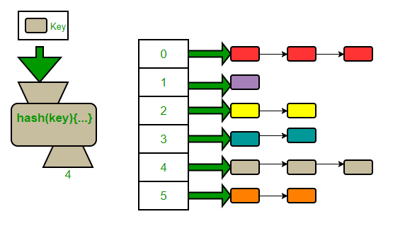

## equals를 재정의하려거든 hashCode도 재정의하라

### hashCode 규약
#### 1) equals 비교에 사용되는 정보가 변경되지 않았다면, 애플리케이션이 실행되는 동안 객체의 hashCode 메서드는 몇 번을 호출해도 항상 같은 값을 반환한다.
(단, 애플리케이션을 다시 실행하면 값은 바뀔 수 있다.)

#### 2) `equals(Object)`가 두 객체를 같다고 판단했으면, 두 객체의 hashCode 값은 항상 같다.
hashCode 재정의를 잘못했을 때 크게 문제가 되는 조항. `equals`는 물리적으로 다른 두 객체를 논리적으로는 같다고 할 수 있다. 하지만 Object의 기본 `hashCode` 
메서드는 이 둘이 전혀 다르다고 판단하여 다른 값을 반환한다. 

```java
Map<PhoneNumber, String> m = new HashMap<>();
m.put(new PhoneNumber(707,867,5309),"제니");

//"제니"가 아니라, null이 반환됨.
m.get(new PhoneNumber(707,867,5309));

```
여기에는 두개의 phoneNumber 인스턴스가 사용되었다. 하나는 **hashMap**에  '제니'를 넣을 때 사용, 다른 하나는 이를 꺼내려할 때 사용하였다. 
여기서 phoneNumber 클래스는 hashCode를 재정의하지 않았기 때문에 논리적 동치인 두 객체가 다른 `hashCode`를 반환. 따라서 이 두번째 규약에 위배된다.
그 결과, get 메서드는 엉뚱한 해시 버킷에 가서 객체를 찾으려고 한 것이다. 

이 문제를 해결하기 위해 phoneNumber에 `hashCode` 메서드만 작성해주면 된다. 

#### 3) 하지만, `equals(Object)`가 두 객체를 다르다고 판단했더라도, 두 객체의 hashCode 값은 같을 수 있다. (해시 충돌)

```java
@Override public int hashCode() { return 42; }

```
위 코드는 동치인 모든 객체에서 똑같은 해시코드를 반환하니 적법하다. 그러나 모든 객체에게 똑같은 값만 내어다 주므로 모든 객체가 해시테이블의 버킷 하나에
담겨 마치 연결리스트(Linked list)처럼 동작한다.
좋은 해시 함수라면 서로 다른 인스턴스에 다른 해시코드를 반환한다.

#### 해시 충돌(그림 참고)

<div align='center'>
    
</div>

hashTable 크기는 한정적이기 때문에 같은 서로 다른 객체라 하더라도 같은 해시값을 갖게 될 수 있다. 위 그림과 같이 해당 버킷에 Linkedlist 형태로 객체를 추가한다.

### hashCode 작성 요령
해시코드는 인스턴스마다 다른 해시코드를 반환한다. 이상적인 해시 함수는 서로 다른 인스턴스들을 32비트 점수 범위에 균일하게 분배해야 한다.
좋은 hashCode를 작성하는 간단한 요령을 알아보자.

1.
int 변수 result를 선언한 후 값 c로 초기화한다. 이 때 c는 해당 객체의 첫 번째 핵심 필드를 단계 2.a 방식으로 계산한 해시코드다. (핵심필드는 equals에서 사용하는 필드와 동일해야 한다)
2.
나머지 핵심 필드 f 각각에 대해 다음 작업을 수행한다.
	a. 해당 필드의 해시코드 c를 계산한다.
		i.
		기본 타입 필드라면 BoxingType.hashCode(f)를 수행한다.
		ii.
		참조 타입 필드면서 이 클래스의 equals 메서드가 이 필드의 equals 메서드를 재귀적으로 호출해 비교한다면, 이 필드의 hashCode를 재귀적으로 호출한다. 계산이 더 복잡해 진다면 필드의 표준형을 만들어 표준형의 hashCode를 호출한다. 필드의 값이 null이면 0을 사용한다.
		iii.
		필드가 배열이라면, 핵심 원소 각각을 별도 필드처럼 다룬다. 모든 원소가 핵심 원소라면 Arrays.hashCode를 사용한다.
	b.
	단계 2.a에서 계산한 해시코드 c로 result를 갱신한다. 코드로는 다음과 같다.
	
	```java
	result = 31 * result + c
	```
	여기서 31을 곱하는 이유는 홀수이면서 소수이기 때문이다. 만약 이 숫자가 짝수이고 오버플로가 발생한다면 정보를 잃게 된다. 굳이 소수인 경우는 전통적으로 그리 해온것이라고,,한다..
	아무래도 계산의 최적화를 위함이겠죠..?
3.
result를 반환한다.

아래 코드는 이를 적용한 예시이다.

```java
// Typical hashCode method
@Override public int hashCode() {
int result = Short.hashCode(areaCode);
	result = 31 * result + Short.hashCode(prefix);
	result = 31 * result + Short.hashCode(lineNum);
	return result;
}

```
phoneNumber 인스턴스의 핵심 필드 3개만을 사용해 간단한 계산만을 수행, 비결정적 요소는 전혀 없으므로 동치 인스턴스들은 같은 해시코드를 가질 것이 확실하다.

#### Objects.hash 활용

```java
// One-line hashCode method - mediocre performance
@Override public int hashCode() {
	return Objects.hash(lineNum, prefix, areaCode);
}

```
위와 같은 해시함수를 비슷하게 구현해 놓은 `Objects.hash` 메서드가 있다. 성능이 민감하지 않은 상황에선 사용할 수 있다.
해시함수를 한줄로 작성할 수 있지만, 속도가 느리다.

#### 해쉬값 캐싱 방법 (= 지연 초기화)
클래스가 불변이고 해시코드를 계산하는 비용이 크다면 해쉬코드를 캐싱하는 방법을 고려할 수 있다.

```java
// 지연초기화하여 해쉬를 캐싱하는 방법
private int hashCode; // 자동으로 0으로 초기화

@Override public int hashCode() {
	int result = hashCode;
	if (result == 0) {
		result = Short.hashCode(areaCode);
		result = 31 * result + Short.hashCode(prefix);
		result = 31 * result + Short.hashCode(lineNum);
		hashCode = result;
	}
	return result;
}

```

### 이 외에도 해시코드 생성시 주의사항

1. 성능을 높이기 위해 해시코드를 계산할 때 핵심 필드를 생략하면 안 된다. 해시코드의 분포를 고르게 나누어주는 효과가 있기 때문이다.
2. hashCode가 반환하는 값의 생성 규칙을 API 사용자에게 자세히 공표하지 않는 것이 좋다. 그래야 클라이언트가 이 값에 의지하지 않고, 추후에 계산 방식을 바꿀 수 있다.


```
🐱상혁 : 그렇다면 이렇게 매번 hashCode를 직접 재정의해야할까?
🌱영현 : AutoValue 프레임워크를 사용하면 equals와 hashCode를 자동으로 만들어주기도 해. 이외에도 intellij 등의 ide들도 이런 기능을 제공해줘!
```

**intellij로 equals, hashCode 재정의 자동화**

- [참고 블로그](https://inpa.tistory.com/entry/JAVA-%E2%98%95-equals-hashCode-%EB%A9%94%EC%84%9C%EB%93%9C-%EA%B0%9C%EB%85%90-%ED%99%9C%EC%9A%A9-%ED%8C%8C%ED%97%A4%EC%B9%98%EA%B8%B0)

---

### 📌 Reference

- 이펙티브 자바
- [[Java] equals() & hashcode() 메서드는 언제 재정의해야 할까?](https://velog.io/@sonypark/Java-equals-hascode-%EB%A9%94%EC%84%9C%EB%93%9C%EB%8A%94-%EC%96%B8%EC%A0%9C-%EC%9E%AC%EC%A0%95%EC%9D%98%ED%95%B4%EC%95%BC-%ED%95%A0%EA%B9%8C#java-hashtable)
