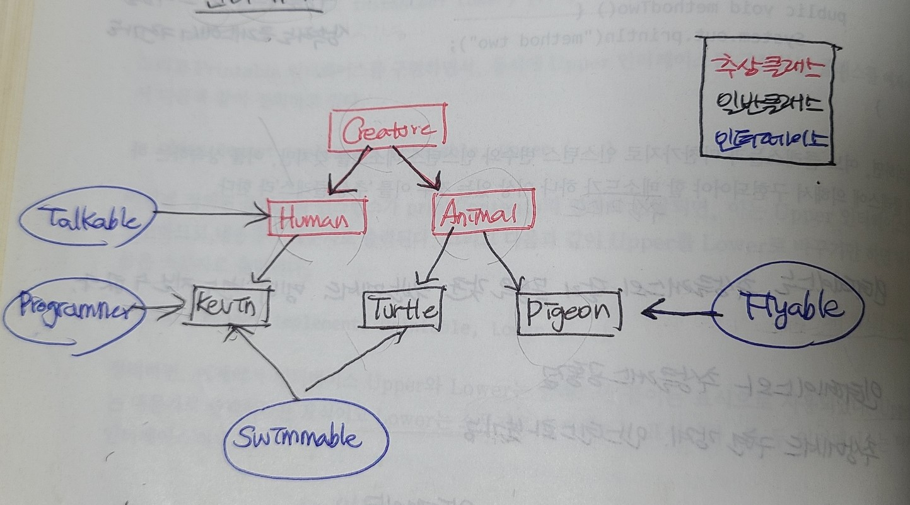

## 추상 클래스보다는 인터페이스를 우선하라

### 추상 클래스(Abstract Class)
추상 클래스란 하나 이상의 추상 메소드를 갖는 클래스를 가리킵니다.

```java
public abstract class House {
    public void methodOne() {
        System.out.println("method one");
    }

    public abstract void methodTwo(); //추상 메소드
}
```

이렇듯 추상 클래스에는 위에서 보이듯이 클래스의 선언부에 `abstract` 선언을 추가해야 합니다.  

### 인터페이스(Interface)
자바에서 인터페이스란 `연결점` 또는 `접점`으로 둘 사이를 연결하는 매개체를 뜻합니다.  

```java
interface Printable {
    public void print(String doc); //추상 메소드
}
```

위에서 보이듯이 메소드의 몸체가 비어 있는 메소드를 가리켜 `추상 메소드(Abstract Methods)`라고 하며, 인터페이스의 모든 메소드는 public이 선언된 것으로 간주합니다.

### 추상 클래스와 인터페이스의 비교
### 공통점
- 추상 메서드 구현을 강제한다.
- 인스턴스화 불가능하다.

### 차이점
- 인터페이스
    - 다중 구현 가능
    - 상수만 가질 수 있음
    - 메서드는 기본적으로 `public`
- 추상 클래스
    - 단일 상속 가능
    - 인스턴스 변수 가질 수 있음
    - 메서드는 다양한 접근 제한자 가질 수 있음

만약 모든 클래스가 인터페이스를 사용해서 기본틀을 구성한다면, 공통으로 필요한 기능들도 모든 클래스에서 재정의(Overriding) 해야합니다.  
Why?  
인터페이스의 메서드는 추상 메서드이기에 메서드의 몸체가 없습니다. 따라서 상속하는 클래스에서 구현해 주어야 합니다.  

```
🐱영현 : 그럼 추상 클래스의 일반 메서드를 사용하여, 상속하는 자식 클래스들이 공통된 기능을 정의하면 안돼? (= 공통으로 필요하는 메서드들을 추상 클래스로 묶으면 안돼?)
🌱상혁 : 안되지~ 왜냐하면 Java는 클래스간 단일 상속만 지원하며 만약 각각 다른 추상 클래스를 상속하는데 공통된 기능이 필요하다면 인터페이스를 사용해!
```  
<br></br>

<div align="center">
    
</div>  

```
🌱상혁 : Kevin가 Turtle 둘 다 수영이 가능해. 그럼 Creature 클래스마다 Swim 추상 메서드를 만들어야해? 아니면 각각 Human, Animal에 추상 메서드를 만들어줘야해?
🐱영현 : 음..
🌱상혁 : Human과 Animal 중 수영 못하는 객체가 존재가능하니까 인터페이스를 만들어줘서 구현하게끔 하면 돼
```  

위 사진에서 확인 가능한 추상 클래스와 인터페이스의 차이점은 다음과 같습니다.  
- 추상 클래스 : 상속 관계를 쭉 타고 올라갔을 때 같은 조상 클래스를 상속하는데 기능까지 같은 기능이 필요할 때 사용합니다.  
- 인터페이스 : 상속 관계를 쭉 타고 올라갔을 때 다른 조상 클래스를 구현하지만 같은 기능이 필요할 때 사용합니다.

### 인터페이스의 장점
### 1. 믹스인(Mix) 정의
믹스인이란 클래스가 구현 가능한 타입으로, 이를 구현한 클래스에 원래의 **주된 타입** 외에도 특정 선택적 행위를 제공한다고 선언하는 효과를 줍니다.  

- 다중 상속의 대안 : 자바와 같은 언어에서는 다중 상속을 지원하지는 않지만, 인터페이스를 통해 여러 기능을 하나의 클래스에 믹스인 할 수 있습니다.  
- 기능의 재사용성 : 특정 기능을 여러 클래스에서 재사용할 수 있도록 도와줍니다. 
    - `예시` : 로깅, 이벤트 처리, 데이터 검증 등의 기능을 각각 인터페이스로 정의하고, 필요한 클래스에서 이를 구현하면 됩니다  
- 구현의 분리 : 서로 다른 기능을 독립적으로 구현하고, 이를 조합하여 클래스를 구성 가능합니다. => 코드의 가독성과 유지보수성이 높아집니다.  

`예시` : 동물이 이동하고 소리를 내는 기능을 각각 인터페이스로 정의하고, 이를 믹스인해서 다양한 동물 클래스를 구성 가능합니다.  

```java
// 이동 기능을 정의하는 인터페이스
public interface Movable {
    void move();
}

// 소리를 내는 기능을 정의하는 인터페이스
public interface Soundable {
    void makeSound();
}

// Movable과 Soundable 인터페이스를 모두 구현하는 클래스
public class Dog implements Movable, Soundable {
    @Override
    public void move() {
        System.out.println("개가 움직인돠");
    }

    @Override
    public void makeSound() {
        System.out.println("멍멍!");
    }
}

// Movable과 Soundable 인터페이스를 모두 구현하는 또 다른 클래스
public class Cat implements Movable, Soundable {
    @Override
    public void move() {
        System.out.println("고양이가 움직인돠");
    }

    @Override
    public void makeSound() {
        System.out.println("냐옹~");
    }
}

public class Main {
    public static void main(String[] args) {
        Dog dog = new Dog();
        Cat cat = new Cat();
        
        dog.move(); // "개가 움직인돠"
        dog.makeSound(); // "멍멍!"
        
        cat.move(); // "고양이가 움직인돠"
        cat.makeSound(); // "냐옹~"
    }
}
```  
이처럼 대상 타입의 `주된 기능 + 선택적 기능`을 믹스인이라고 합니다.  
추상 클래스는 단일 상속을 지원하기에 믹스인이 불가능합니다.  

### 2. 계층구조가 없는 타입 프레임워크  
👧 영현이라는 객체가 Student인 동시에 Woman인 경우에

- 추상 클래스
    - 속성이 n개이면 2<sup>n</sup> 개의 조합을 가지는 고도비만 계층구조가 만들어집니다.
    ```java
    public abstract class Student {
        // ...
    }

    public abstract class Woman {
        // ...
    }

    // 단일 상속만 가능하기 때문에 여성인 동시에 학생인 추상 클래스가 필요하다.
    public abstract class StudentWoman {
        // ...
    }

    public class 영현 extends SutdentIntern {
        // ...
    }
    ```
- 인터페이스
    - 계층구조가 없는 타입 프레임 워크를 만들 수 있습니다.
    ```java
    public interface Student {
        // ...
    }

    public interface Woman {
        // ...
    }

    // 문제 없다.
    public class 영현 implements Student, Woman {
        // ...
    }
    ```

### 3. 안전하고 강력한 수단
인터페이스 메서드 중 명백한 구현 방법이 있는 메서드라면 디폴트 메서드로 만들어서 간편함을 제공 가능합니다.  

```
🐱영현 : 디폴트 메서드는 만능이야?
🌱상혁 : 아니? 꼭 그렇지만은 않아
``` 

### 디폴드 메서드의 제한 사항
### 1. Object 메서드는 디폴트 메서드로 제공해서는 안된다
#### 1-1. 의미적 일관성 
`equals`와 `hashCode`와 같은 Object의 메서드들은 객체의 논리적 동등성과 해시 코드를 결정하는 중요한 메서드입니다.  
이러한 메서드들은 객체의 상태 즉, 객체의 필드값에 강하게 의존하기에 필드를 정의할 수 없는 인터페이스 수준에서는 일괄적으로 정의하기 어렵습니다.  

```java
public class Person {
    private String name;
    private int age;

    @Override
    public boolean equals(Object obj) {
        if (this == obj) return true;
        if (obj == null || getClass() != obj.getClass()) return false;
        Person person = (Person) obj;
        return age == person.age && Objects.equals(name, person.name);
    }

    @Override
    public int hashCode() {
        return Objects.hash(name, age);
    }
}
```  

위 예제에서와 같이 `Person` 클래스가 `name`과 `age` 필드를 가지고 있다면 `equals`와 `hashCode`는 이 두 필드를 기반으로 작성됩니다.  

```java
interface Person {
    String getName();
    int getAge();
}

class Student implements Person {
    private String name;
    private int age;
    private String studentId;
    
    // equals와 hashCode는 name, age, studentId 기반으로 구현
}

class Teacher implements Person {
    private String name;
    private int age;
    private String employeeId;
    
    // equals와 hashCode는 name, age, employeeId 기반으로 구현
}
```  
반면, 인터페이스를 구현하는 클래스들은 각기 다른 필드와 상태를 가질 수 있으며, `equals`와 `hashCode`의 구현 방식도 달라집니다.  

따라서, 인터페이스 수준에서 일괄적으로 정의하는 것은 적절하지 않고, 각 클래스가 자신의 상태에 맞게 메서드를 구현해야 합니다.

#### 1-2. 충돌 방지
인터페이스에서 제공하는 디폴트 메서드들은 명시적으로 오버라이드하지 않으면 인터페이스에서 제공한 디폴트 구현을 사용하게 된다는 것을 의미합니다.  
이로 인해 `Object` 클래스의 기본 구현과 충돌 가능성이 있습니다.  

```java
interface EffectiveDuo {
    default void effectiveDuo() {
        System.out.println("Default 구현");
    }
}

class SH implements EffectiveDuo {
    //...
}

public class Main {
    public static void main(String[] args) {
        SH obj = new SH();
        obj.effectiveDuo();  // "Default 구현" 출력
    }
}
```
`SH` 클래스에서 effectiveDuo를 오버라이드하지 않으면, EffectiveDuo의 디폴트 메서드를 사용하게 됩니다.  

위 예제 코드와 같이 Object 클래스와의 충돌 가능성이 발생할 수 있습니다.  
자바의 모든 클래스는 `Object` 클래스를 상속받기에 `Object` 클래스의 기본 메서드를 자동으로 가집니다.  
- equals, hashCode, toString, clone, finalize 등  
만약 인터페이스가 이러한 메서드를 디폴트 메서드로 제공할 경우 문제가 발생합니다.  

```java
interface EffectiveDuo {
    default boolean equals(Object obj) {
        // 특정 구현 제공
        return true;
    }
    
    default int hashCode() {
        // 특정 구현 제공
        return 42;
    }
}

class YH implements EffectiveDuo {
    // equals와 hashCode를 오버라이드하지 않음
}

public class Main {
    public static void main(String[] args) {
        YH obj1 = new YH();
        YH obj2 = new YH();
        
        System.out.println(obj1.equals(obj2));  // true 출력 (인터페이스의 디폴트 메서드 사용)
        System.out.println(obj1.hashCode());    // 42 출력 (인터페이스의 디폴트 메서드 사용)
    }
}

```  
위 코드와 같이 `YH` 클래스가 `equals`와 `hashCode`를 오버라이드 하지 않으면 `EffectiveDuo`의 디폴트 메서드를 구현하게 되며 `Object` 클래스의 기본 구현과 다르게 동작합니다.  
이럴 경우 **논리적 일관성**이 깨질 수 있습니다.

### 추상 골격 구현 클래스(skeletal implementation)
추상 골격 구현 클래스는 인터페이스의 대부분의 메서드를  구현하고 몇 가지 중요한 메서드만을 추상 메서드로 남겨 하위 클래스가 이를 구현하게 함을 의미합니다.  
예를 들어 자바 표준 라이브러리 중 `Collection` 인터페이스와 이를 위한 추상 골격 구현 클래스인 `AbstractCollection`을 예시로 들 수 있습니다.  

```java
public interface Collection<E> {
    int size();
    boolean isEmpty();
    boolean contains(Object o);
    Iterator<E> iterator();
    Object[] toArray();
    <T> T[] toArray(T[] a);
    boolean add(E e);
    boolean remove(Object o);
    boolean containsAll(Collection<?> c);
    boolean addAll(Collection<? extends E> c);
    boolean removeAll(Collection<?> c);
    boolean retainAll(Collection<?> c);
    void clear();
    boolean equals(Object o);
    int hashCode();
}
```
```java
public abstract class AbstractCollection<E> implements Collection<E> {
    @Override
    public boolean isEmpty() {
        return size() == 0;
    }

    @Override
    public boolean contains(Object o) {
        Iterator<E> it = iterator();
        if (o == null) {
            while (it.hasNext())
                if (it.next() == null)
                    return true;
        } else {
            while (it.hasNext())
                if (o.equals(it.next()))
                    return true;
        }
        return false;
    }

    @Override
    public Object[] toArray() {
        Object[] r = new Object[size()];
        Iterator<E> it = iterator();
        for (int i = 0; i < r.length; i++) {
            if (!it.hasNext())
                return Arrays.copyOf(r, i);
            r[i] = it.next();
        }
        return it.hasNext() ? finishToArray(r, it) : r;
    }

    // ...

    @Override
    public boolean add(E e) {
        throw new UnsupportedOperationException();
    }

    @Override
    public boolean remove(Object o) {
        Iterator<E> it = iterator();
        if (o == null) {
            while (it.hasNext()) {
                if (it.next() == null) {
                    it.remove();
                    return true;
                }
            }
        } else {
            while (it.hasNext()) {
                if (o.equals(it.next())) {
                    it.remove();
                    return true;
                }
            }
        }
        return false;
    }

    @Override
    public boolean containsAll(Collection<?> c) {
        for (Object e : c)
            if (!contains(e))
                return false;
        return true;
    }

    @Override
    public boolean addAll(Collection<? extends E> c) {
        boolean modified = false;
        for (E e : c)
            if (add(e))
                modified = true;
        return modified;
    }

    @Override
    public boolean removeAll(Collection<?> c) {
        boolean modified = false;
        Iterator<E> it = iterator();
        while (it.hasNext()) {
            if (c.contains(it.next())) {
                it.remove();
                modified = true;
            }
        }
        return modified;
    }

    @Override
    public boolean retainAll(Collection<?> c) {
        boolean modified = false;
        Iterator<E> it = iterator();
        while (it.hasNext()) {
            if (!c.contains(it.next())) {
                it.remove();
                modified = true;
            }
        }
        return modified;
    }

    @Override
    public void clear() {
        Iterator<E> it = iterator();
        while (it.hasNext()) {
            it.next();
            it.remove();
        }
    }

    @Override
    public abstract Iterator<E> iterator();
    
    @Override
    public abstract int size();
}
```  
위 코드를 면밀히 살펴보면 `AbstractCollection` 클래스는 `Collection` 인터페이스의 많은 메서드를 기본 구현으로 제공합니다.  
하지만 `iterator()`와 `size()` 메서드는 추상 메서드로 남겨두어 하위 클래스가 이를 반드시 구현하게끔 합니다.  

<br></br>

다른 예시로 `AbstractList` 클래스와 `List` 인터페이스도 있습니다.  
이를 상속하여 `ArrayList`, `LinkedList` 등의 구체적인 리스트 구현체를 만들 수 있습니다.  

```java
public class EffectiveDuoList<E> extends AbstractList<E> {
    private E[] elements;
    private int size;
    
    // EffectiveDuoList의 고유한 필드와 메서드 정의
    
    @Override
    public E get(int index) {
        // get 메서드 구현
    }
    
    @Override
    public int size() {
        return size;
    }
    
    @Override
    public Iterator<E> iterator() {
        // iterator 메서드 구현
    }
}
```  
이렇게 추상 골격 구현 클래스를 사용할 경우 인터페이스를 쉽게 구현할 수 있도록 도와주며, 일관성 있는 코드 작성에 도움을 줍니다.  
  
하지만 구조상 골격 구현을 확장하지 못하는 경우도 존재합니다.  
### 이미 다른 클래스를 확장하고 있는 경우
자바는 다중 상속을 지원하지 않기에, 한 클래스가 다른 클래스를 이미 상속받고 있는 경우 추상 골격 구현 클래스를 확장할 수 없습니다.  
```java
class SomeOtherClass {
    // ...
}

abstract class AbstractCollectionImpl<E> extends SomeOtherClass implements Collection<E> {
    @Override
    public boolean isEmpty() {
        return size() == 0;
    }

    @Override
    public boolean contains(Object o) {
        // 구현
        return false;
    }

    @Override
    public abstract Iterator<E> iterator();
    
    @Override
    public abstract int size();
}

class MyCustomCollection<E> extends SomeOtherClass implements Collection<E> {
    @Override
    public boolean isEmpty() {
        return size() == 0;
    }

    @Override
    public boolean contains(Object o) {
        // 커스텀 구현
        return false;
    }

    @Override
    public Iterator<E> iterator() {
        // 커스텀 구현
        return null;
    }
    
    @Override
    public int size() {
        // 커스텀 구현
        return 0;
    }
}
```  
위 코드에서 `MyCustomCollection` 클래스가 이미 `someOtherClass`를 확장하고 있기에 `AbstractCollectionImpl` 클래스를 확장할 수 없습니다.  
즉, `Collection` 인터페이스 메서드들을 직접 구현해야 합니다. 😝

```
🐱영현 : 그럼 위의 상황에서는 아예 사용이 불가능해?
🌱상혁 : 항상 방법은 있더라구
```  
private 내부 클래스로 간접적으로 사용 가능합니다.  

```java
interface SomeInterface {
    void someMethod();
}

interface AnotherInterface {
    void anotherMethod();
}
```
```java
abstract class AbstractCollectionImpl<E> implements Collection<E> {
    @Override
    public boolean isEmpty() {
        return size() == 0;
    }

    @Override
    public boolean contains(Object o) {
        // ...
        return false;
    }

    @Override
    public Object[] toArray() {
        // ...
        return new Object[0];
    }

    @Override
    public <T> T[] toArray(T[] a) {
        // ...
        return null;
    }

    @Override
    public boolean add(E e) {
        throw new UnsupportedOperationException();
    }

    @Override
    public boolean remove(Object o) {
        throw new UnsupportedOperationException();
    }

    @Override
    public boolean containsAll(Collection<?> c) {
        // ...
        return false;
    }

    @Override
    public boolean addAll(Collection<? extends E> c) {
        boolean modified = false;
        for (E e : c)
            if (add(e))
                modified = true;
        return modified;
    }

    @Override
    public boolean removeAll(Collection<?> c) {
        boolean modified = false;
        Iterator<?> it = iterator();
        while (it.hasNext()) {
            if (c.contains(it.next())) {
                it.remove();
                modified = true;
            }
        }
        return modified;
    }

    @Override
    public boolean retainAll(Collection<?> c) {
        boolean modified = false;
        Iterator<E> it = iterator();
        while (it.hasNext()) {
            if (!c.contains(it.next())) {
                it.remove();
                modified = true;
            }
        }
        return modified;
    }

    @Override
    public void clear() {
        Iterator<E> it = iterator();
        while (it.hasNext()) {
            it.next();
            it.remove();
        }
    }

    @Override
    public abstract Iterator<E> iterator();

    @Override
    public abstract int size();
}
```
```java
// 외부 클래스가 이미 다른 클래스를 상속받고 있는 경우
class AnotherBaseClass {
    // 기본 클래스의 구현
}

// 외부 클래스 정의
class MyCustomClass<E> extends AnotherBaseClass implements SomeInterface, AnotherInterface, Collection<E> {
    private final CollectionImpl collectionImpl = new CollectionImpl();

    // 내부 클래스 정의
    private class CollectionImpl extends AbstractCollectionImpl<E> {
        // 필요한 메서드를 구현
        @Override
        public Iterator<E> iterator() {
            // iterator 구현
            return new Iterator<E>() {
                // 실제 구현 생략
                @Override
                public boolean hasNext() { return false; }
                @Override
                public E next() { return null; }
            };
        }

        @Override
        public int size() {
            // size 구현
            return 0;
        }
    }

    // SomeInterface 메서드 구현
    @Override
    public void someMethod() {
        // ...
    }

    // AnotherInterface 메서드 구현
    @Override
    public void anotherMethod() {
        // ...
    }

    // Collection 인터페이스 메서드 구현 (내부 클래스에 위임)
    @Override
    public boolean isEmpty() {
        return collectionImpl.isEmpty();
    }

    @Override
    public boolean contains(Object o) {
        return collectionImpl.contains(o);
    }

    @Override
    public Iterator<E> iterator() {
        return collectionImpl.iterator();
    }

    @Override
    public int size() {
        return collectionImpl.size();
    }

    @Override
    public Object[] toArray() {
        return collectionImpl.toArray();
    }

    @Override
    public <T> T[] toArray(T[] a) {
        return collectionImpl.toArray(a);
    }

    @Override
    public boolean add(E e) {
        return collectionImpl.add(e);
    }

    @Override
    public boolean remove(Object o) {
        return collectionImpl.remove(o);
    }

    @Override
    public boolean containsAll(Collection<?> c) {
        return collectionImpl.containsAll(c);
    }

    @Override
    public boolean addAll(Collection<? extends E> c) {
        return collectionImpl.addAll(c);
    }

    @Override
    public boolean removeAll(Collection<?> c) {
        return collectionImpl.removeAll(c);
    }

    @Override
    public boolean retainAll(Collection<?> c) {
        return collectionImpl.retainAll(c);
    }

    @Override
    public void clear() {
        collectionImpl.clear();
    }
}
```  
외부 클래스가 내부 클래스보고 **야 대신 작업해줘** 라며 위임하는 것과 동일합니다.  

### 단순 구현(Simple Implementation)
단순 구현은 특정 인터페이스를 구현하는 간단한 클래스입니다. 
일반적으로, 단순 구현 클래스는 추상 클래스가 아닐 수 있으며, 완전히 구현된 상태로 제공되어 바로 사용 가능합니다.  
예시로, `AbstractMap.SimplyEntry`이 있습니다.  

---

### 📌 Reference
- 이펙티브 자바
- 윤성우의 열혈 Java 프로그래밍

